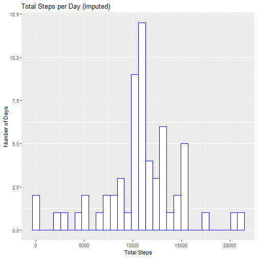

---
---
title: "PA1_template"
author: "CWJvanBlommestein"
date: "27022025"
output:
  html_document:
    keep_md: true
---

---

# Introduction

This report analyzes activity monitoring data, including total steps per day, average steps per interval, and differences between weekday and weekend activity patterns.


# Data Preparation


``` r
# Read data
data <- read.csv("activity.csv", stringsAsFactors = FALSE)

# Convert 'date' to Date format
data$date <- as_date(data$date)
```

## Summary of Missing Values


``` r
# Count missing values
missing_values <- sapply(data, function(x) sum(is.na(x)))
missing_values
```

```
##    steps     date interval 
##     2304        0        0
```

# Step Count Analysis

## Total Steps per Day


``` r
# Aggregate total steps per day
agg_data <- data %>%
  group_by(date) %>%
  summarise(steps_per_day = sum(steps, na.rm = TRUE))

# Plot histogram of total steps per day
ggplot(agg_data) +
  geom_histogram(aes(steps_per_day), fill = "white", color = "blue", bins = 30) +
  labs(title = "Total Steps per Day", x = "Total Steps", y = "Number of Days")
```


## Mean and Median Steps per Day


``` r
mean_steps_day <- mean(agg_data$steps_per_day, na.rm = TRUE)
med_steps_day <- median(agg_data$steps_per_day, na.rm = TRUE)

# Print results
mean_steps_day
```

```
## [1] 9354.23
```

``` r
med_steps_day
```

```
## [1] 10395
```

# Activity Patterns Across Intervals


``` r
# Aggregate average steps per interval
agg_interval <- data %>%
  group_by(interval) %>%
  summarise(avg_steps_per_interval = mean(steps, na.rm = TRUE))

# Plot average steps per interval
ggplot(agg_interval) +
  geom_line(aes(interval, avg_steps_per_interval), lwd = 1.1, color = "blue") +
  labs(title = "Average Steps per Interval", x = "Interval", y = "Average Steps")
```


## Interval with Maximum Average Steps


``` r
max_interval <- filter(agg_interval, avg_steps_per_interval == max(avg_steps_per_interval))
max_interval
```

```
## # A tibble: 1 x 2
##   interval avg_steps_per_interval
##      <int>                  <dbl>
## 1      835                   206.
```

# Imputing Missing Values


``` r
# Fill missing values using mean steps per interval
data_filled <- data %>%
  left_join(agg_interval, by = "interval") %>%
  mutate(steps = ifelse(is.na(steps), avg_steps_per_interval, steps))
```

## Total Steps per Day (After Imputation)


``` r
agg_filled <- data_filled %>%
  group_by(date) %>%
  summarise(steps_per_day = sum(steps))

# Plot histogram of total steps per day after imputation
ggplot(agg_filled) +
  geom_histogram(aes(steps_per_day), fill = "white", color = "blue", bins = 30) +
  labs(title = "Total Steps per Day (Imputed)", x = "Total Steps", y = "Number of Days")
```



# Weekday vs Weekend Activity


``` r
# Add weekday information
data_filled <- data_filled %>%
  mutate(week_day = wday(date, label = TRUE))

# Separate weekdays and weekends
weekdays_data <- filter(data_filled, week_day %in% c("Mon", "Tue", "Wed", "Thu", "Fri"))
weekends_data <- filter(data_filled, week_day %in% c("Sat", "Sun"))

# Aggregate average steps per interval for weekdays and weekends
agg_weekdays <- weekdays_data %>%
  group_by(interval) %>%
  summarise(avg_steps_per_interval = mean(steps, na.rm = TRUE))

agg_weekends <- weekends_data %>%
  group_by(interval) %>%
  summarise(avg_steps_per_interval = mean(steps, na.rm = TRUE))

# Plot weekday and weekend patterns
plot_weekdays <- ggplot(agg_weekdays) +
  geom_line(aes(interval, avg_steps_per_interval), lwd = 1.1, color = "blue") +
  labs(title = "Weekday Activity", x = "Interval", y = "Avg Steps") +
  scale_y_continuous(limits = c(0, 220))

plot_weekends <- ggplot(agg_weekends) +
  geom_line(aes(interval, avg_steps_per_interval), lwd = 1.1, color = "blue") +
  labs(title = "Weekend Activity", x = "Interval", y = "Avg Steps") +
  scale_y_continuous(limits = c(0, 220))

grid.arrange(plot_weekdays, plot_weekends, nrow = 2)
```


# Conclusion

-   The mean number of steps per day is 9354.2295082, and the median is 10395.
-   The highest average steps occur at interval 835, with 206.1698113 steps.
-   Imputing missing values changed the step distribution.
-   Step activity patterns differ between weekdays and weekends.

This report provides insight into daily step counts and interval-based movement patterns, helping to understand trends in physical activity.
